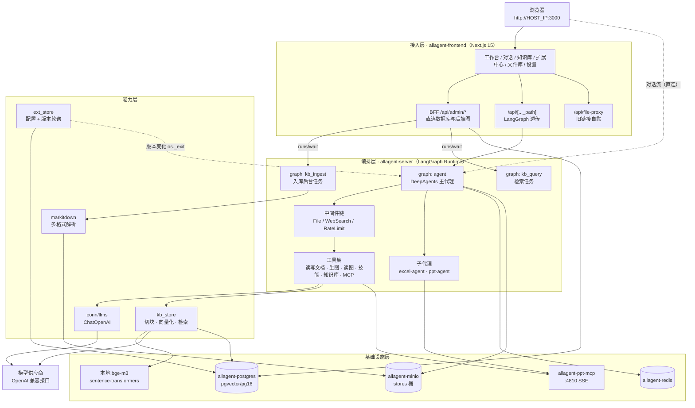
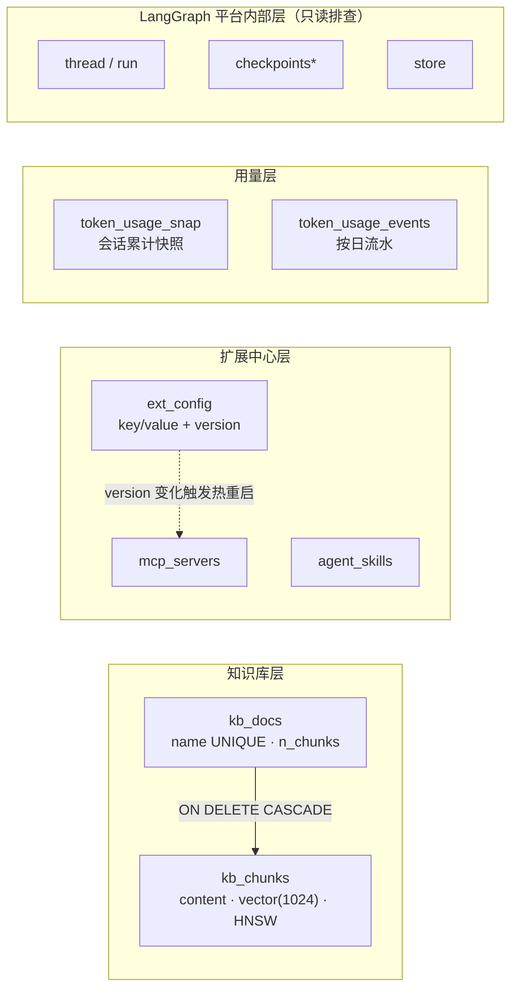
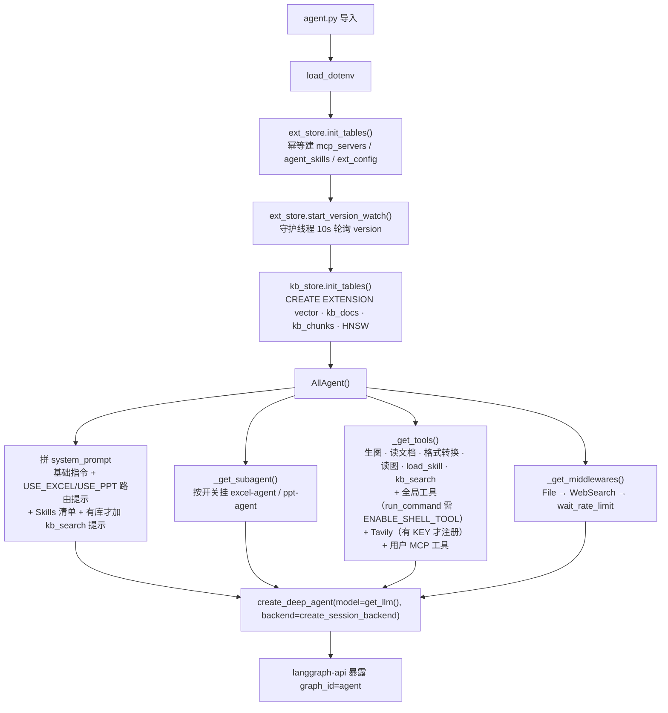
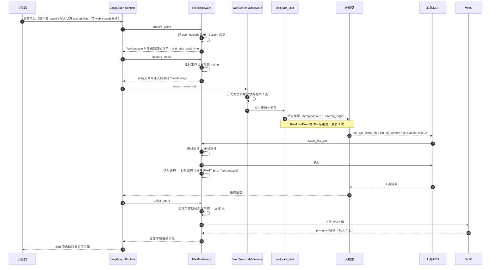
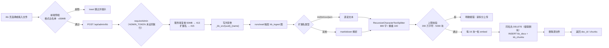
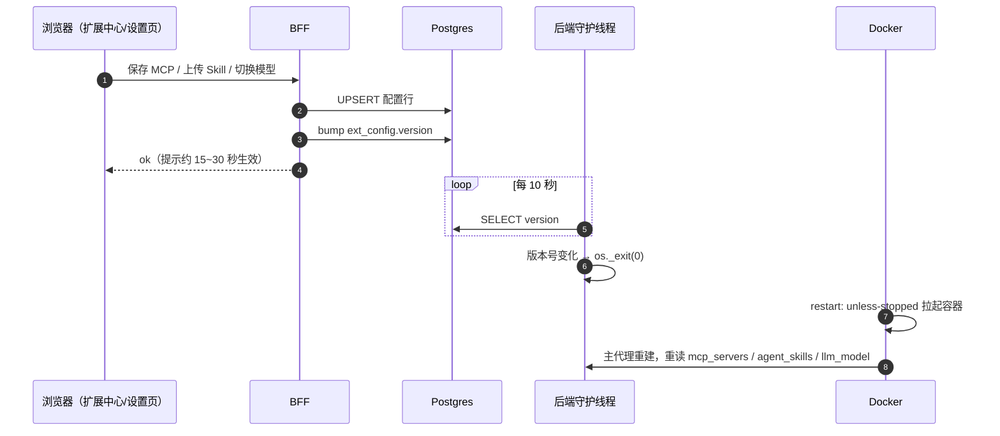

# 星海通用智能体（General_Agent）

> 基于 **LangGraph + DeepAgents** 的**可自托管、可扩展、能交付文件成果**的通用智能体平台。
> 主代理编排子代理与工具，支持多模态输入、个人知识库 RAG、MCP / Agent Skills 自助扩展、
> 模型在线切换，前后端与基础设施全容器化，单机 Docker Desktop 即可跑起完整栈。

---

## 目录

| # | 章节 | 内容 |
|---|---|---|
| [1](#1-项目背景) | 项目背景 | 定位、要解决的问题域、技术选型背景 |
| [2](#2-解决痛点) | 解决痛点 | 8 类实际痛点与对应实现 |
| [3](#3-技术创新点) | 技术创新点 | 9 项工程设计与取舍理由 |
| [4](#4-系统架构) | 系统架构 | 分层架构图、容器编排、数据层 |
| [5](#5-代码逻辑) | 代码逻辑 | 启动装配序列、一次对话生命周期时序图、三条关键流程 |
| [6](#6-功能模块使用指南) | 功能模块使用指南 | 7 个页面的完整操作步骤与边界说明 |
| [7](#7-快速开始与部署) | 快速开始与部署 | 前置条件、配置、构建、访问入口 |
| [8](#8-配置参考) | 配置参考 | 全部环境变量与生效方式 |
| [9](#9-数据与运维) | 数据与运维 | 表结构、常用命令、回归自测、换模型 |
| [10](#10-安全说明) | 安全说明 | 鉴权边界、危险开关、凭据策略 |
| [11](#11-故障排查) | 故障排查 | 症状 → 根因 → 处置 |
| [12](#12-项目成效与验证) | 项目成效与验证 | 交付清单与实测数据 |
| [13](#13-目录结构) | 目录结构 | 代码地图 |
| [14](#14-约束与已知取舍) | 约束与已知取舍 | 升级红线与未做的事 |

---

## 1. 项目背景

通用大模型在产品化落地上长期存在三段断裂：

1. **会说不等于会做**。多数对话界面只能产出文本，任务真正需要的 Excel 清洗、PPT 成稿、
   带图文档等**文件成果**无法自动交付，用户仍需把结果手工搬运回本地。
2. **私有资料进不了模型**。把内部规范、运维手册贴进上下文受长度与泄露双重限制，
   而现成的 SaaS 知识库方案要求资料上传外网，涉密与内网场景直接不可用。
3. **扩展能力被代码锁死**。想给智能体接一个新工具（内部系统 API、专用格式转换），
   通常要改代码、重新构建、重启服务，普通使用者被排除在能力扩展之外。

本项目针对这三段断裂给出一套**可自托管的完整实现**：以 DeepAgents 作为主代理编排框架，
用 LangGraph 承载运行时与检查点，把"文件工作区 + 知识库 + 工具扩展 + 用量统计"
四件事做进同一个 Web 工作台，并以 Docker Compose 一键起栈。

**技术栈**：Python 3.11 · LangGraph 1.2 · DeepAgents 0.6 · LangChain 1.4 · pgvector/PG16 ·
MinIO · Redis 6 · Next.js 15 + BFF · TailwindCSS · MCP（langchain-mcp-adapters）。

---

## 2. 解决痛点

| 痛点 | 后果 | 本项目的实现 | 落点 |
|---|---|---|---|
| 模型产出散落在工作目录，用户拿不到 | 每次都要远程截屏/复制粘贴 | 任务结束自动把会话工作目录打包 zip 上传 MinIO，回传可下载链接 | `content/middles/file_manager_middle.py` |
| 多文件/多轮任务互相污染 | 同名文件被覆盖、结果张冠李戴 | 按 `thread_id` 分配独立虚拟根目录，模型只见相对路径 | `content/others/mybackend.py` |
| 私有资料无法安全利用 | 贴上下文超长、传 SaaS 有泄露风险 | 本地知识库 RAG：解析→切块→向量化→`kb_search` 检索并标注来源 | `content/kb_*_graph.py`、`content/utils/kb_store.py` |
| Embedding 必须联网调 API | 内网/离线不可用，且按量计费 | `EMBEDDING_MODEL` 填本地目录即用 sentence-transformers 进程内推理，自动做盘符→挂载点映射 | `kb_store.embed_texts()` |
| 加工具要改代码重部署 | 使用者无法自助扩展 | 扩展中心填 URL 即接入 MCP 服务器；上传 `.md`/`.zip` 即装载 Agent Skills | `content/mcps/dynamic_mcp.py`、`mytools/skill_tools.py` |
| 配置改了不生效 | 必须人工重启，运维介入 | 写库 + bump 版本号 → 后端轮询自杀 → Docker 拉起重建 | `content/utils/ext_store.py` |
| 换模型要改环境变量重启 | 试错成本高 | 设置页在线切换（列表来自供应商 `/v1/models`），约 10~30 秒生效 | `api/admin/models` |
| PDF/Word/PPT/Excel 解析门槛高 | 每种格式一套解析代码且常出错 | markitdown 统一转文本，11 种扩展名同一入口 | `utils/doc_utils/markitdown_util.py` |
| 模型限流直接报错中断任务 | 长任务半途失败 | `wait_rate_limit` 中间件捕获 `RateLimitError`，90 秒 × 3 次退避重试 | `content/middles/wait_rate_limit.py` |
| Token 消耗不可见 | 无法评估成本、定位高耗会话 | 工作台近 14 天输入/输出堆叠图 + Top5 会话下钻 | `api/admin/usage`、`token_usage_*` 表 |
| 局域网 IP 漂移后旧文件链接全断 | 历史消息里的附件打不开 | `file-proxy` 解析 presigned URL 改走容器内网直连取流 | `api/file-proxy`、`lib/file-url-utils.ts` |
| 单机方案不敢分享给同事 | 任何访问者都能改配置 | 可选 `ADMIN_TOKEN`：一处设值，20 个管理接口全部要求令牌 | `src/lib/admin/guard.ts` |

---

## 3. 技术创新点

### 3.1 用"进程自杀"换取零改造的热生效

LangGraph 官方运行时（`langgraph-api`）不支持插件热重载。本项目不去 fork 运行时，而是建立一条
最小闭环：**BFF 写库 → `ext_config.version` 自增 → 后端守护线程 10 秒轮询发现变化 → `os._exit(0)`
→ Docker `restart: unless-stopped` 拉起 → 主代理重建时重新读取 MCP / Skills / 模型配置**。
代价是中断在途请求（约 10~30 秒），收益是**扩展能力完全数据驱动**，且运行时保持官方镜像。

### 3.2 "伪装成图"的后台任务入口

知识库入库不是对话智能体，而是注册为独立 graph 的**后台任务**：`kb_ingest` / `kb_query`。
前端把文件落到共享卷，BFF 用 `runs/wait` 同步触发。这样 Node 侧无需重写 markitdown 解析与
embedding 推理，直接复用 Python 运行时能力，同时天然获得 LangGraph 的重试、并发与可观测性。

### 3.3 双模 Embedding 自动判定

`EMBEDDING_MODEL` 既可以是本地模型目录，也可以是供应商模型名。运行时用 `os.path.isdir` 判定：
命中目录走 sentence-transformers 本地推理（离线、零调用成本），否则走 OpenAI 兼容
`/v1/embeddings`。Windows 宿主机路径 `D:\models\...` 自动去盘符映射为容器内 `/models/...`，
**同一份 `.env` 在本地裸跑与容器内都可正确解析**。

### 3.4 会话级虚拟文件系统 + 三处钩子的路径编排

`LazyFilesystemBackend` 按 `thread_id` 隔离根目录并懒加载（避免导入期创建目录阻塞事件循环）。
`FileMiddleware` 在 `abefore_agent`（用户附件 base64 落盘并回传路径清单）、
`abefore_model`（检测工作目录变化，注入目录树让模型"知道现在有哪些文件"）、
`aafter_agent`（有新产物则打包上传并回传下载链接）三个生命周期钩子编排任务，
并在 `awrap_tool_call` 做**相对↔绝对路径双向转换**——模型永远只看见短路径，
既省 token 又避免路径穿越。

### 3.5 中间件级的运行时能力开关

联网搜索开关不通过重启实现：前端把 `web_search` 作为状态字段随消息提交，
`WebSearchMiddleware` 在每次模型调用前从 `request.tools` 中剔除内置搜索工具（按加载时打的
`metadata.web_search_builtin` 标记识别）。因此**开关粒度是"下一条消息起生效"**，且老会话续聊
未显式传值时默认视为开启，向后兼容。

### 3.6 Skills 两段式加载控制 token 成本

系统提示词只注入"名称 + 描述"清单，正文由模型判断匹配后调用 `load_skill` 按需拉取，
附件留在 `_skills/<技能名>/` 由 `get_file_content` 读取。装 20 个技能与装 1 个技能的
固定 token 成本几乎相同。

### 3.7 检索链路与写入链路同源

前端"检索命中测试"、主代理 `kb_search` 工具、实际入库使用**同一个 embedding 来源与同一张表**，
避免了"测试面板命中而模型检索不到"这类双实现偏差。相关度以 `1 - 余弦距离` 呈现，
并为 `emb` 列建立 HNSW 余弦索引（`vector_cosine_ops`），检索走近邻查找而非全表顺序扫描。

### 3.8 fail-fast 配置层

必需变量（`HOST_IP` / `MINIO_ACCESS_KEY` / `MINIO_SECRET_KEY`）缺失时**启动即抛错**，
绝不静默回退到硬编码值。历史上静默回退曾造成 MinIO presigned 链接指向错误地址、
前端 `Failed to fetch`，且症状离根因极远。

### 3.9 高危能力默认摘除 + 可选鉴权

`run_command`（让模型执行任意 shell）默认**不在工具列表中**，需 `ENABLE_SHELL_TOOL=true` 显式开启；
20 个管理接口 handler 统一经 `requireAdmin` 守卫，常量拆分到无服务端依赖的模块，
避免客户端组件导入时把 `next/server` 打进浏览器 bundle。默认形态保持"本机自用零打扰"，
需要共享时一处设值即可收紧。

---

## 4. 系统架构

### 4.1 分层架构图



### 4.2 容器编排

| 容器 | 镜像 | 职责 | 端口 |
|---|---|---|---|
| `allagent-server` | `allagent-server:latest` | LangGraph 运行时，注册 `agent` / `kb_ingest` / `kb_query` 三图 | `8000` |
| `allagent-frontend` | `allagent-ui:latest` | 对话 UI + 管理页 + BFF | `3000` |
| `allagent-postgres` | `pgvector/pgvector:pg16` | 检查点、扩展配置、知识库向量 | **仅 `127.0.0.1:5432`** |
| `allagent-minio` | `minio/minio` | 附件、生成文件、会话归档 zip（`stores` 桶） | `9000` / `9001` |
| `allagent-redis` | `redis:6` | 限流与任务状态缓存 | 内部 `6379` |
| `allagent-ppt-mcp` | `allagent-ppt-mcp:latest` | PPT 生成 MCP 服务 | 内部 `4810` |

卷 `agent_files` 被后端与前端**共享**：前端写上传源文件、后端读并回写产物，
文件库页面直接浏览该卷。

### 4.3 数据层



---

## 5. 代码逻辑

### 5.1 进程启动装配（`agent.py` → `AllAgent`）



模型优先级：`ext_config.llm_model`（设置页在线切换）→ 缺失/读库失败回退 `.env` 的 `BASE_LLM`。
任何单个 MCP 服务器连接失败只告警跳过（20 秒超时），不阻塞启动。

### 5.2 一次对话的完整生命周期



### 5.3 知识库入库链路



降级防线：切块器不可用时会记录 `已降级为按空行分段` 告警，而非静默运行在退化路径上
（历史上该包缺失曾长期静默，导致切块粒度与预期不符、召回分数贴地）。

### 5.4 扩展配置热生效链路



### 5.5 前端与后端的三条通道

| 通道 | 路径 | 用途 |
|---|---|---|
| 对话流 | 浏览器 **直连** `http://HOST_IP:8000` | 流式消息、工具调用、中断审批；地址来自 `/api/env` |
| 管理 | `/_next` 同源 `/api/admin/*` | 知识库、扩展中心、模型切换、文件库、统计（BFF 直连 DB 与后端图） |
| 自愈 | `/api/file-proxy?u=<原始链接>` | 历史消息里的 presigned 链接经容器内网 `minio:9000` 取流回传 |

Provider 侧有就绪门控：`ThreadProvider` 在 `/api/env` 返回前不发线程请求，
`StreamProvider` 在返回前不挂载 `StreamSession`（`useStream` 一建立就会请求
`/threads/{id}/history`）；若 `/api/env` 返回的地址为空（`API_URL` 未注入），
界面落到地址配置表单而不是静默重试 `localhost:2024`。

---

## 6. 功能模块使用指南

左侧固定导航共 6 项，底部有**服务状态灯**（每 15 秒探测后端，绿=正常，红=重启中/不可达）。

### 6.1 工作台 `/`

| 区块 | 内容 | 说明 |
|---|---|---|
| 统计卡 | 会话总数 · 文件产出 · 启用 MCP · 启用技能 | 每 30 秒刷新 |
| Token 消耗 | 近 14 天输入/输出堆叠柱图 + 累计值 | 数据来自流式返回的 `usage`，无数据显示占位提示 |
| Top5 会话 | 消耗最高的会话标签 | 点击直达 `/chat?threadId=...` |
| 场景快捷入口 | 文档分析 / Excel / PPT / 联网调研 / 图片生成 | 点击带模板 prompt 进入对话 |
| 最近会话 | 最近更新列表 | 点击进入对话 |

### 6.2 对话 `/chat`

- **输入**：文本、拖拽/点击上传附件（自动转 base64 入状态）、语音输入
  （Web Speech API，浏览器不支持时按钮自动隐藏）。
- **开关**：`联网搜索`（下一条消息起生效）、`隐藏工具消息`。
  两者可在 `/settings` 设默认值，URL 带 `?webSearch=` / `?hideToolCalls=` 时以 URL 为准，便于分享固定偏好的链接。
- **过程可见**：工具调用与返回以可折叠消息呈现；命中中断（human-in-the-loop）时出现审批按钮。
- **消息操作**：复制（非 HTTPS 环境自动降级 `execCommand`，失败有明确 toast）、重新生成、分支切换。
- **交付物**：任务产生新文件时自动追加 zip 下载链接。
- **快捷键**：Enter 发送 / Shift+Enter 换行（可在设置页改为 Enter 仅换行、Ctrl+Enter 发送）。

### 6.3 知识库 `/kb`

**上传**：点右上「上传资料」或直接把文件拖到页面（出现"松开即上传入库"遮罩）。

1. 支持 `pdf docx doc pptx ppt xlsx xls csv md txt json`，混入不支持的格式会跳过其余照常入库。
2. 单文件 ≤ 50 MB（前端预检 + 服务端硬校验）；解析后 ≤ 200 万字符、≤ 5000 块。
3. 首次入库可能卡在"入库中"1~2 分钟——容器在加载本地 bge-m3，属正常，之后每次仅需数秒。
4. **同名重传即覆盖**（先删旧块再写新块），不会产生重复文档。

**检索测试**：页面下方输入问题 → 返回 top 命中，显示来源文档、相关度分数与片段原文。
与模型实际使用的 `kb_search` 同源，可用来验证"模型能不能查到"。

**删除**：列表行删除按钮，级联删向量块并清理残留源文件。

> 建议：Markdown（带清晰标题分节）召回质量明显优于扫描版 PDF。
> 配套测试文档与测试问题清单见 `knowledge_base_samples/`，
> 其中 `00_测试问题清单.md` 是操作手册，**不要上传入库**。

### 6.4 扩展中心 `/extensions`

**MCP 服务器**（自助接入 URL 型，`sse` / `streamable_http`）：

1. 填写名称、URL、传输类型、可选请求头（鉴权 token 等）。
2. 「测试连接」会实际连接该服务器并列出它提供的工具，避免填错地址。
3. 保存后服务约 15~30 秒自动重启生效，期间对话可能短暂中断。
4. 工具名会自动加 `{服务器名}_` 前缀，防止多服务器同名冲突。
5. 单个服务器不可达只告警跳过（20 秒超时），不影响其他服务器与主代理启动。

**Agent Skills**（`SKILL.md` 规范）：

1. 上传单个 `.md` 或含 `SKILL.md` 的 `.zip`（附件解压到 `_skills/<技能名>/`）。
2. 可启停、编辑描述、删除。
3. 模型只在提示词里看到"名称 + 描述"，判断任务匹配时调 `load_skill` 取正文并遵照执行，
   参考文件用 `get_file_content` 读取。

### 6.5 文件库 `/files`

浏览 `agent_files` 共享卷（各会话工作区、生成图片、知识库暂存等），支持下载与删除。
下方「会话归档清理」可检测并删除**已删除会话遗留在 MinIO `stores` 桶的孤儿 zip**。
命令行等价：`node scripts/cleanup_threads.mjs`。

### 6.6 设置 `/settings`

- **对话大模型切换**：当前模型 + 供应商 `/v1/models` 清单（不可达时回退为 `.env` 里的默认值列表），
  选择后写库并触发热重启。
- **模型服务（只读）**：`BASE_LLM` / `BASE_VLM` / `IMAGE_MODEL` / `EDIT_IMAGE_MODEL` /
  API Base URL / 后端地址。视觉与生图模型仍需改 `.env` 并重建容器。
- **对话偏好**：默认隐藏工具消息、默认开启联网搜索、Enter 发送。存 localStorage，可一键恢复默认。

### 6.7 解锁页 `/admin-unlock`

仅当 `.env` 设置了 `ADMIN_TOKEN` 时需要：输入一次令牌写入 Cookie（30 天），
之后所有管理请求由浏览器自动携带。未启用鉴权时本页直接提示"该实例未启用管理接口鉴权"。

---

## 7. 快速开始与部署

### 7.1 前置条件

- Docker Desktop（含 Compose v2），磁盘预留 3~4 GB（后端镜像含 torch CPU 版）
- 一个 OpenAI 兼容的模型供应商 API Key（示例配置为阿里云百炼）
- 一个 LangSmith 账号的 API Key（基础镜像 `langchain/langgraph-api` 启动时要校验镜像授权）
- 可选：本地 embedding 模型目录（如 `D:\models\embedding\bge-m3`，SentenceTransformer 格式）

### 7.2 配置并启动

```powershell
copy .env.example .env
# 至少填写：HOST_IP、OPENAI_API_KEY、LANGSMITH_API_KEY、MINIO_ACCESS_KEY、MINIO_SECRET_KEY
docker compose -f docker-compose.build.yml up -d --build
```

单独重建某个服务（改动前端代码后）：

```powershell
docker compose -f docker-compose.build.yml build agent-chat-ui
docker compose -f docker-compose.build.yml up -d agent-chat-ui
```

> ⚠️ `.env` 变量在容器**创建**时注入：改完必须 `up -d --force-recreate`，单纯 `restart` 不生效。

### 7.3 访问入口

| 入口 | 地址 |
|---|---|
| Web UI | `http://<HOST_IP>:3000` |
| LangGraph API 文档 | `http://<HOST_IP>:8000/docs` |
| MinIO 控制台 | `http://<HOST_IP>:9001` |
| 数据库（仅本机） | `localhost:5432`，`postgres/postgres` |

### 7.4 本地开发（不走 Docker）

```powershell
# 后端：conda 环境 + .env 就位（excel stdio MCP 依赖 conda Scripts 在 PATH）
pip install -r requirements.txt
langgraph dev            # 读 langgraph.json，默认 :2024

# 前端
cd sub_projects/agent-chat-ui
pnpm install
pnpm dev
```

`langgraph dev` 用内存检查点、重启即丢会话，仅适合调试图逻辑；
持久化行为必须在 Docker 下验证。

---

## 8. 配置参考

完整模板见 `.env.example`（含逐项注释）。要点速览：

| 变量 | 必需 | 说明 |
|---|---|---|
| `HOST_IP` | ✅ | 宿主机局域网 IP，presigned 链接与前端 API 地址依赖；DHCP 环境建议路由器 MAC 静态绑定 |
| `MODEL_API_BASE_URL` / `OPENAI_API_KEY` | ✅ | OpenAI 兼容供应商 |
| `BASE_LLM` | ✅ | 对话主模型默认值（可在线切换覆盖） |
| `BASE_VLM` / `IMAGE_MODEL` / `EDIT_IMAGE_MODEL` | ✅ | 读图 / 文生图 / 图像编辑 |
| `EMBEDDING_MODEL` | ✅ | 本地模型目录 **或** 供应商模型名（自动判定） |
| `EMBEDDING_DIM` | ✅ | 必须与模型输出维度一致（bge-m3 / text-embedding-v4 均 1024） |
| `MINIO_ACCESS_KEY` / `MINIO_SECRET_KEY` | ✅ | 口令至少 8 字符，否则 MinIO 起不来 |
| `LANGSMITH_API_KEY` | ✅ | 企业版基础镜像授权，缺失即 403 |
| `USE_PPT` / `USE_EXCEL` | | 子代理开关（PPT 依赖 ppt-mcp，Excel 依赖 uvx excel-mcp-server） |
| `TAVILY_SEARCH_KEY` | | 留空则不注册联网搜索工具 |
| `ADMIN_TOKEN` | | 留空=不校验（默认）；设值则 20 个管理接口需令牌 |
| `ENABLE_SHELL_TOOL` | | 默认 false；true 才把 `run_command` 交给模型 |
| `AGENT_UI_PORT` / `AGENT_SERVER_PORT` / `MINIO_PORT` / `MINIO_CONSOLE_PORT` | | 端口覆盖 |

> `USE_PDF` 为历史遗留项，代码中无此开关（PDF 由 markitdown 自动处理），保留仅为兼容旧 `.env`。

---

## 9. 数据与运维

### 9.1 数据库表

| 表 | 归属 | 说明 |
|---|---|---|
| `kb_docs` / `kb_chunks` | 后端 `kb_store.py` | 文档元信息（`name` 唯一，重传即覆盖）/ 切块正文 + `vector(1024)`（含 HNSW 余弦索引） |
| `mcp_servers` / `agent_skills` / `ext_config` | 后端 `ext_store.py`（前端同构建表） | MCP 注册、技能、键值配置与**版本号** |
| `token_usage_snap` / `token_usage_events` | 前端 BFF | 会话累计用量快照 / 按日流水 |
| `thread` / `run` / `checkpoints*` / `store` | LangGraph 框架 | 会话、运行、状态快照。**只读排查，禁止手工 DML**，否则检查点链断裂会导致历史会话打不开 |

查看知识库内容：PyCharm Database 面板（`localhost:5432`）、
`docker exec allagent-postgres psql -U postgres -d postgres -c "select id,name,n_chunks from kb_docs;"`，
或直接看 `/kb` 页面的检索命中测试。

### 9.2 常用命令

```powershell
docker compose -f docker-compose.build.yml ps                    # 健康状态
docker logs allagent-server --tail 100                           # 后端日志
docker exec allagent-postgres psql -U postgres -d postgres -c "select name,n_chunks from kb_docs;"
docker exec allagent-server uv pip freeze                        # 查实际依赖版本
node scripts/cleanup_threads.mjs                                 # 清理 MinIO 孤儿归档
```

### 9.3 回归自测

改动入库/检索/上传相关代码后先跑一键回归（27 项，覆盖健康检查、上传硬校验、
切块数合理性、召回 A1~A9 与负例 A10、同名覆盖、清理）：

```powershell
node scripts/kb_regression.mjs            # 跑完清空知识库
node scripts/kb_regression.mjs --keep     # 保留样例文档继续手工测试
```

前置：`.env` 未设 `ADMIN_TOKEN`。脚本会上传并删除 `knowledge_base_samples/` 三份样例，
**不要在你的正式知识库实例上跑**。

### 9.4 换 embedding 模型的正确姿势

```sql
DELETE FROM kb_chunks; DELETE FROM kb_docs;
```

改 `.env` 的 `EMBEDDING_MODEL` / `EMBEDDING_DIM` →
`docker compose -f docker-compose.build.yml up -d --force-recreate allagent` → 重新上传全部资料。
**不清库直接换模型会导致新旧向量混存，检索结果完全错乱**（不同模型向量空间不通用）。

---

## 10. 安全说明

平台默认按"个人本机自用"设计，**默认无登录鉴权**。要在局域网多人使用，务必处理三点：

1. **启用管理鉴权**：`.env` 设 `ADMIN_TOKEN=<随机长字符串>` 并重建前端容器。
   此后 `/api/admin/*`（知识库、扩展中心、模型切换、文件库、统计）全部要求令牌，
   浏览器访问 `/admin-unlock` 输入一次即可。未启用时，任何能访问 3000 端口的人
   都能删除你的知识库、改写 MCP 配置、反复触发服务重启。
2. **不要开启 `ENABLE_SHELL_TOOL`**：`run_command` 可让大模型（含被检索进知识库/网页的
   提示注入文本）在后端容器内执行任意 shell，而容器环境变量持有数据库口令与 API Key。
   默认已从工具列表移除，仅在完全信任的环境下显式置 `true`。
3. **凭据不留默认值**：`HOST_IP` / `MINIO_ACCESS_KEY` / `MINIO_SECRET_KEY` 缺失时后端
   **启动即报错**而不是回退硬编码值。

> ⚠️ **`ADMIN_TOKEN` 的边界**：它只守卫前端 BFF 的 `/api/admin/*`。对话链路是**浏览器直连
> `http://<HOST_IP>:8000`** 的 LangGraph API，而该服务自身无鉴权——知道地址的人仍可直接读写
> 会话、创建运行。因此 `ADMIN_TOKEN` 定位是"防误操作与半熟人越权"，**不是身份认证**，
> 不能对抗主动攻击者。对外提供务必不要放行 8000 端口（改为仅 `127.0.0.1` 绑定或前置反代）。
> 真要多租户使用，需另加用户体系与会话隔离。

另外：PostgreSQL 端口仅绑定 `127.0.0.1`，不暴露局域网；MinIO 端口默认对局域网开放，
按需修改 compose 绑定或使用强口令。

---

## 11. 故障排查

| 症状 | 原因与处置 |
|---|---|
| 前端 `TypeError: Failed to fetch` | `HOST_IP` 与实际 IP 不符（DHCP 漂移）。以 `ipconfig` 实测为准，改 `.env` 后 `up -d --force-recreate`（restart 无效）。根治建议路由器做 MAC 静态绑定 |
| 后端容器反复重启 / 报 403 | `LANGSMITH_API_KEY` 缺失或无效 |
| 后端起不来并提示缺少环境变量 | `configs.py` 的 fail-fast：按提示补 `.env` 后重建容器 |
| 知识库"入库中"卡住 1~2 分钟 | 首次加载本地 bge-m3，正常；之后每次入库仅需数秒 |
| 检索命中分数普遍 <0.45 | 换了 embedding 模型但未清库；或文档切块过大——改 Markdown 分节重传 |
| 日志出现 `已降级为按空行分段切块` | `langchain-text-splitters` 未安装/版本异常，切块粒度已不符合预期，需修复依赖后清库重灌 |
| 上传大文件报 413 / 格式报 415 / 空文件报 422 | 均为**预期**校验，按提示拆分或换格式 |
| 管理接口全部返回 401 | 已设 `ADMIN_TOKEN`，访问 `/admin-unlock` 输入令牌（Cookie 30 天） |
| 复制按钮无反应 | `http://<IP>:3000` 属非安全上下文，Clipboard API 不可用；已内置 `execCommand` 降级，若仍失败请强刷（Ctrl+F5） |
| 对话报错但只看到 `An error occurred` / `An internal error occurred` | 模型供应商的错误会被 `langgraph-api` 收敛成通用文案，**真实原因只在后端日志里**：`docker logs allagent-server --tail 100`。实例：`OpenAIPermissionDeniedError: Error code: 403 - AllocationQuota.FreeTierOnly` 表示百炼该模型免费额度已用完且账号处于“仅用免费额度”模式，需充值/关闭该模式，或改用一个仍有额度的模型 |
| 控制台反复报 `localhost:2024` 连接被拒 | 旧版前端竞态。现版本 `/api/env` 就绪前不挂载会话组件、不发线程请求；若仍出现请先强制刷新以丢弃缓存的旧页面 JS |
| Excel 子代理启动失败 `WinError 2` | 本地裸跑时 conda `Scripts` 不在 PATH，`excel_mcp.py` 已内置 `uvx` 回退查找 |
| 构建拉包超时 / 403 | 网络源问题，PyPI 与 apt 统一使用 `mirrors.aliyun.com` |

---

## 12. 项目成效与验证

### 12.1 交付清单

| 维度 | 规模 |
|---|---|
| 可运行服务 | 6 个容器，一条 `up -d --build` 起全栈 |
| 智能体图 | 3 个（`agent` 主代理、`kb_ingest` 入库、`kb_query` 检索） |
| Web 页面 | 7 个（工作台 / 对话 / 知识库 / 扩展中心 / 文件库 / 设置 / 解锁） |
| 管理接口 | 9 个 BFF 路由、20 个 handler，全部纳入鉴权守卫 |
| 数据表 | 7 张业务表 + LangGraph 内部表；向量检索走 HNSW 索引 |
| 支持格式 | 知识库 11 种扩展名统一入口（markitdown 解析） |
| 文档 | 本 README + `.env.example` 逐项注释 + 知识库测试文档与问题清单 |

### 12.2 实测数据（本机 Docker 环境，全链路真实调用）

| 验证项 | 结果 |
|---|---|
| 知识库一键回归 `scripts/kb_regression.mjs` | **27 / 27 通过** |
| 召回质量 A1~A9（精确事实、换词泛化、中段埋针、双载体、跨文档、平台操作、故障处置、协议细节、数据级别） | top1 全部命中预期文档且片段含预期关键值，相关度 **0.507 ~ 0.714** |
| 负例判别（问库里没有的内容） | 最高相关度 **0.368**，与正例拉开明显差距 |
| 上传硬校验 | 超 50 MB → 413、非法扩展名/无扩展名 → 415、空内容 → 422，均按预期拒绝并给出可操作提示 |
| 同名覆盖 | 重传不产生重复文档，改值后立刻可检索到新值 |
| 真实对话链路 | 主代理正确调用 `kb_search`，无结果时如实告知（不编造） |
| 鉴权开启态 | 无凭据/错令牌 → 401；令牌经请求头或 Cookie 均放行；删除与 MCP 注册等写操作全部受守卫；解锁页可达 |
| 依赖可重现性 | `requirements.txt` 全量锁定为容器实测版本，构建不再受上游发版影响 |

### 12.3 关键效果

- **能力扩展从"改代码"变成"填表单"**：接入一个 MCP 服务器 / 上传一个技能，约 15~30 秒自动生效。
- **私有资料可全离线利用**：本地 embedding + 本地向量库，无资料外发；涉密环境可断网运行检索链路。
- **任务真正交付成果**：产物自动打包回传下载链接，会话间文件互不污染。
- **成本可见**：近 14 天 Token 输入/输出与 Top 会话下钻，便于定位高耗用法。

---

## 13. 目录结构

```
.
├── agent.py                    # 进程入口：建表 → 版本轮询 → 装配 AllAgent
├── base/configs.py             # 全部环境变量读取与 fail-fast 校验
├── conn/                       # llms（模型）、minio_conn（对象存储）、gen_img（生图）
├── content/
│   ├── all_agent.py            # 主代理装配：提示词 / 子代理 / 工具 / 中间件
│   ├── kb_ingest_graph.py      # 入库图（解析→切块→向量化→写库）
│   ├── kb_query_graph.py       # 检索图
│   ├── mcps/                   # 内置 excel/ppt/tavily + dynamic_mcp（用户自助接入）
│   ├── middles/                # file_manager / web_search / wait_rate_limit 三个中间件
│   ├── mytools/                # 生图、读图、读写文档、load_skill、kb_search、全局工具
│   ├── others/mybackend.py     # 会话级虚拟文件系统（按 thread_id 隔离 + 懒加载）
│   ├── sub_agents/             # excel-agent / ppt-agent
│   └── utils/                  # ext_store（配置+版本轮询）、kb_store（向量库）、runtime_util
├── utils/                      # markitdown 解析、zip 打包、日志、langchain 辅助
├── sub_projects/
│   ├── agent-chat-ui/          # Next.js 15 前端 + BFF（src/app/api/admin/*、src/lib/admin/*）
│   └── ppt-mcp/                # PPT 生成 MCP 服务
├── knowledge_base_samples/     # 知识库测试文档与测试问题清单
├── scripts/                    # kb_regression.mjs（回归自测）、cleanup_threads.mjs（归档清理）
├── Dockerfile                  # 后端镜像（LANGSERVE_GRAPHS 注册 3 个图）
├── docker-compose.yml          # 运行编排（引用已构建镜像）
├── docker-compose.build.yml    # 从源码构建编排（日常使用这份）
├── .env.example                # 环境变量模板（逐项注释）
└── requirements.txt            # Python 依赖（已锁版本）
```

---

## 14. 约束与已知取舍

- **`deepagents` 锁定 `<0.7`**：0.7 移除了 backend 工厂函数与 `ls_info/grep_raw/glob_info`
  旧协议，升级需同步改造 `content/others/mybackend.py`。
- **热生效会中断在途请求**：采用"进程自杀 + Docker 拉起"，简单可靠；
  如需零中断须改造为优雅重载（当前判断不值得）。
- **切块固定 800 字符 / 重叠 100**：未按 Markdown 标题层级做语义切分；
  当前实测召回 0.5+，若要提升需同时改动 `split_text` 与回归基线。
- **`kb_chunks` 维度在建表时固定**：换 embedding 模型必须清库重灌（见 9.4）。
- **`ADMIN_TOKEN` 不覆盖 `:8000`**：这是 LangGraph 运行时的架构现状，
  对外暴露前必须把端口收回本机或前置反代（见 10）。
- **无 CI**：回归脚本需本地手动执行；对话页 UI 交互与鉴权开启态仍需按
  `knowledge_base_samples/00_测试问题清单.md` 手工验证。
